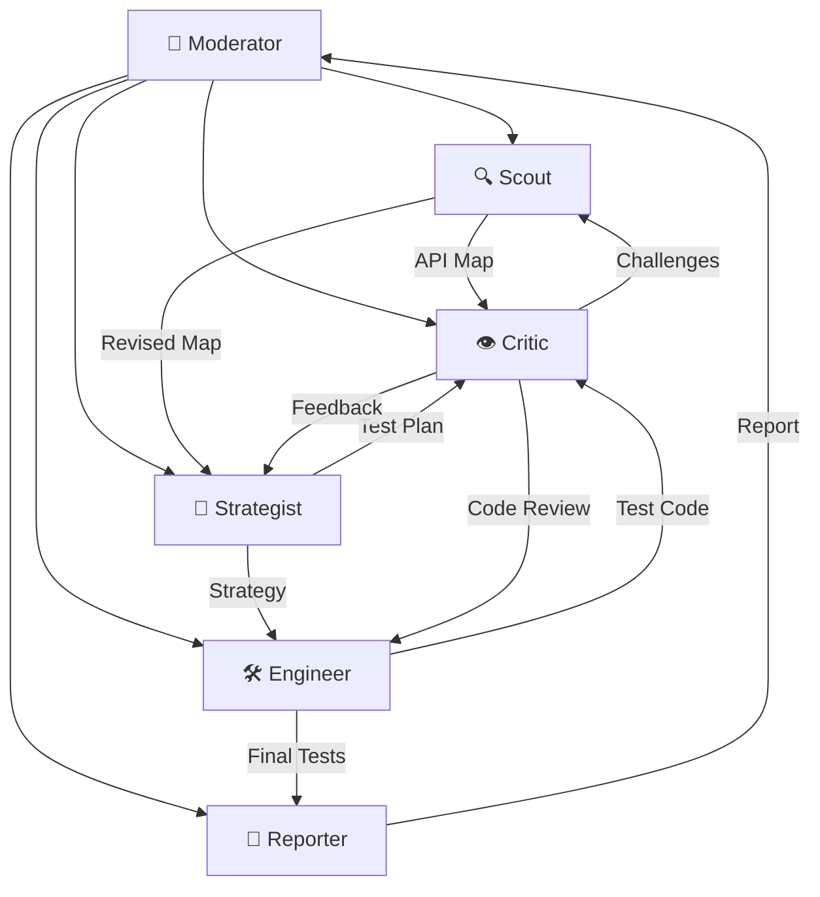

# QA-Council

> A multi-agent QA council that debates, challenges, and collaborates to handle testing workflows — powered by CrewAI and the SKILL.md open standard.

[](https://www.python.org/downloads/)
[](LICENSE)
[](#running-tests)

## What Is This?

QA-Council is a **multi-agent system** where specialized AI agents collaborate as a deliberative council to perform QA tasks. Instead of a single AI doing everything, six agents debate each other's work — catching blind spots, challenging assumptions, and producing higher-quality test strategies and code.

```
🔍 Scout explores API  →  👁️ Critic challenges findings  →  🔍 Scout revises
    🧠 Strategist plans  →  👁️ Critic challenges plan
        🛠️ Engineer codes  →  👁️ Critic reviews code  →  🛠️ Engineer fixes
            📝 Reporter compiles final report
```

## Architecture



### The Council

| Agent | Role | Tools |
|---|---|---|
| 🎯 **Moderator** | Orchestrates phases, manages debate rounds | — |
| 🔍 **Scout** | Discovers endpoints, maps API surfaces | `HttpClientTool`, `SpecParserTool` |
| 🧠 **Strategist** | Designs risk-prioritized test plans | — |
| 🛠️ **Engineer** | Writes pytest/httpx test code | `FileWriterTool`, `TestRunnerTool` |
| 👁️ **Critic** | Challenges everything — finds gaps and blind spots | — |
| 📝 **Reporter** | Compiles results into actionable reports | — |

### Operating Modes

| Mode | Agents | Tasks | Use Case |
|---|---|---|---|
| **NEW** | 6 | 9 | Full council for a new API — complete exploration to report |
| **EXTEND** | 6 | 8 | Add tests to existing coverage — skips strategy critique |
| **MAINTAIN** | 3 | 5 | Fix broken tests — Scout + Engineer + Critic only |

### Key Feature: SKILL.md

Agent behavior is defined in **SKILL.md** files (following the [Agent Skills open standard](https://agentskills.io/)), not hardcoded in Python:

```
skills/
├── scout/SKILL.md        # API exploration instructions
├── critic/SKILL.md       # Adversarial review patterns
├── strategist/SKILL.md   # Risk-based test planning
├── engineer/SKILL.md     # pytest/httpx code patterns
├── reporter/SKILL.md     # Report templates
└── moderator/SKILL.md    # Phase sequencing rules
```

**Why?** Edit agent behavior by changing a markdown file — no code changes needed. Skills are portable, version-controlled, and reviewable in PRs.

## Quick Start

```bash
# Clone
git clone https://github.com/barispe/QA-council.git
cd QA-council

# Install (Python 3.11+ required)
pip install -e ".[dev]"

# Preview what would happen (no LLM calls)
qa-council run --url https://petstore.swagger.io/v2 --mode new --dry-run

# Run with a cloud API key
cp .env.example .env
# Edit .env → set OPENAI_API_KEY=sk-...
qa-council run --url https://petstore.swagger.io/v2 --mode new

# Or run with a local model (no API key needed!)
qa-council run --url https://petstore.swagger.io/v2 --preset ollama
qa-council run --url https://petstore.swagger.io/v2 --preset lmstudio
```

## CLI Reference

```bash
# Full council (NEW mode) — 6 agents, 9 tasks
qa-council run --url <URL> --mode new

# Extend existing tests
qa-council run --url <URL> --mode extend

# Quick fix mode — 3 agents only
qa-council run --url <URL> --mode maintain

# Cloud model presets
qa-council run --url <URL> --preset budget     # gpt-4o-mini everywhere
qa-council run --url <URL> --preset balanced   # mix of models
qa-council run --url <URL> --preset premium    # claude-sonnet-4-20250514 everywhere

# Local model presets (no API key needed!)
qa-council run --url <URL> --preset ollama         # llama3 via Ollama
qa-council run --url <URL> --preset ollama-qwen    # qwen2.5:14b via Ollama
qa-council run --url <URL> --preset ollama-mistral  # mistral via Ollama
qa-council run --url <URL> --preset lmstudio       # loaded model via LM Studio

# Direct local model (auto-detects Ollama/LM Studio from prefix)
qa-council run --url <URL> --model ollama/llama3
qa-council run --url <URL> --model lm_studio/qwen2.5

# Manual base URL for any OpenAI-compatible server
qa-council run --url <URL> --model my-model --base-url http://localhost:11434

# Custom checkpoint level
qa-council run --url <URL> --checkpoints phase  # pause after every phase
qa-council run --url <URL> --checkpoints full   # pause after every task

# Use a custom config file
qa-council run --url <URL> --config my-config.yaml

# Output to custom directory
qa-council run --url <URL> --output ./my-output
```

## Configuration

Default config lives at `config/qa-council.config.yaml`:

```yaml
checkpoints: critical   # none | phase | critical | full

models:
  default: "gpt-4o-mini"
  # base_url: ""  # Set for local LLMs (Ollama/LM Studio)
  per_agent:
    critic: "claude-sonnet-4-20250514"  # use a stronger model for the Critic

presets:
  # Cloud presets
  budget:   { default: "gpt-4o-mini" }
  premium:  { default: "claude-sonnet-4-20250514" }

  # Local model presets
  ollama:         { default: "ollama/llama3",      base_url: "http://localhost:11434" }
  ollama-qwen:    { default: "ollama/qwen2.5:14b", base_url: "http://localhost:11434" }
  ollama-mistral: { default: "ollama/mistral",     base_url: "http://localhost:11434" }
  lmstudio:       { default: "lm_studio/loaded-model", base_url: "http://localhost:1234/v1" }
```

**Priority**: CLI args > config file > built-in defaults.

### Using Local Models (Ollama / LM Studio)

**With Ollama:**
```bash
# 1. Install Ollama → https://ollama.com
# 2. Pull a model
ollama pull llama3
# 3. Run QA-Council
qa-council run --url https://petstore.swagger.io/v2 --preset ollama
```

**With LM Studio:**
```bash
# 1. Install LM Studio → https://lmstudio.ai
# 2. Download a model and start the local server (port 1234)
# 3. Run QA-Council
qa-council run --url https://petstore.swagger.io/v2 --preset lmstudio
```

**Auto-detection:** Model prefixes like `ollama/` and `lm_studio/` automatically set the correct base URL — no extra config needed.

## Project Structure

```
QA-Council/
├── skills/                       # SKILL.md defines agent behavior
│   ├── scout/SKILL.md
│   ├── critic/SKILL.md
│   ├── strategist/SKILL.md
│   ├── engineer/SKILL.md
│   ├── reporter/SKILL.md
│   └── moderator/SKILL.md
├── src/qa_council/
│   ├── main.py                   # CLI entry point
│   ├── config.py                 # YAML config loader with presets
│   ├── checkpoints.py            # Interactive checkpoint system
│   ├── skill_loader.py           # SKILL.md → CrewAI Agent bridge
│   ├── agents/                   # Agent factory functions
│   │   ├── scout.py
│   │   ├── critic.py
│   │   ├── strategist.py
│   │   ├── engineer.py
│   │   ├── reporter.py
│   │   └── moderator.py
│   ├── tasks/                    # Task definitions
│   │   ├── recon.py              # explore → critique → revise
│   │   ├── strategy.py           # plan → critique
│   │   ├── implement.py          # write → review → fix
│   │   └── report.py             # compile final report
│   ├── tools/                    # Custom CrewAI tools
│   │   ├── http_client.py        # HTTP requests
│   │   ├── spec_parser.py        # OpenAPI spec parser
│   │   ├── file_writer.py        # Write test files to disk
│   │   └── test_runner.py        # Run pytest subprocess
│   └── crews/                    # Crew compositions per mode
│       ├── new_crew.py           # Full 9-task pipeline
│       ├── extend_crew.py        # 8-task pipeline
│       └── maintain_crew.py      # 5-task lightweight pipeline
├── config/
│   └── qa-council.config.yaml    # Default configuration
├── tests/
│   ├── test_skill_loader.py      # 8 tests
│   ├── test_tools.py             # 11 tests
│   ├── test_config.py            # 10 tests
│   └── test_checkpoints.py       # 10 tests
└── pyproject.toml
```

## Running Tests

```bash
# Run all 38 tests
pytest tests/ -v

# Run specific test module
pytest tests/test_skill_loader.py -v
pytest tests/test_tools.py -v
pytest tests/test_config.py -v
pytest tests/test_checkpoints.py -v

# Lint check
ruff check src/ tests/

# Format
ruff format src/ tests/
```

## Requirements

- **Python 3.11+**
- **An LLM** — either:
  - A cloud API key (`OPENAI_API_KEY` or `ANTHROPIC_API_KEY` in `.env`), or
  - A local model via [Ollama](https://ollama.com) or [LM Studio](https://lmstudio.ai) (free!)

## How It Works

1. **You run a command** → `qa-council run --url <API> --mode new`
2. **Config loads** → YAML presets + CLI args merged
3. **Agents created** → Each agent loads its behavior from `skills/<name>/SKILL.md`
4. **Crew assembles** → Tasks wired in sequence with the Moderator orchestrating
5. **Debate happens** → Agents execute tasks, Critic challenges after each phase
6. **Output saved** → API map, test code, and report written to `./output/`

## License

MIT
